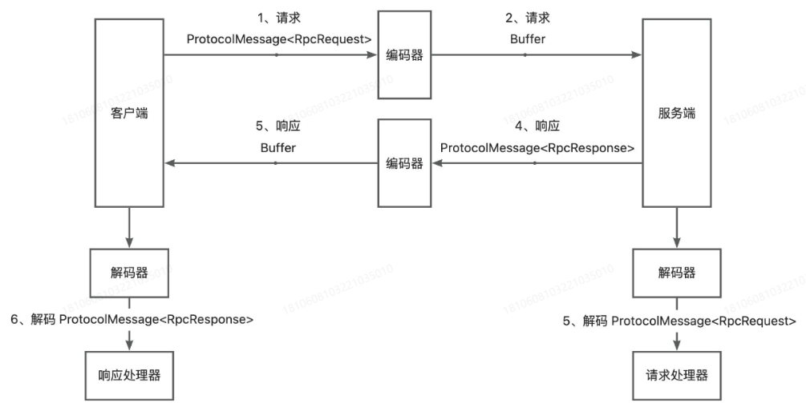

# 自研-高性能 RPC 框架 轮子项目
## RPC 简易版
### 实现
1. Vert.x Web 服务器
2. 本地服务注册器
3. 序列化器接口
   1. JDK 序列化器
4. 请求处理器 - 服务提供者
   1. 反射机制
5. 动态代理 - 服务消费者
   1. JDK 动态代理（实现 **InvocationHandler** 接口 和 ***invoke*** 方法
   2. 静态代理实现：一个类对应一个服务，不灵活（弃）
   3. **设计模式**：代理模式、工厂模式（代理工厂：创建代理实例）
### TODO
- [x] 注册中心和服务发现机制：解决代理发送 HTTP 请求时，服务地址硬编码问题
---
## 全局配置加载
### 需求
RPC 框架涉及多个配置信息，如注册中心的地址、网络服务器端口号、序列化方式等，以上的简易版 RPC 项目中，是在程序里硬编码这些配置的，不利于维护。

允许引入本 RPC 框架的项目通过编写配置文件的方式来**自定义配置**。

因此需要一套全局配置加载功能。能够让 RPC 框架轻松地从配置文件中读取配置，并且维护一个**全局配置对象**，便于框架**快速正确地**获取到一致地配置
### 实现
1. 引入 rpc-core 模块，在 rpc-easy 模块的基础上进行升级和扩展。
2. 实现 .properties 配置文件的加载，支持不同环境的文件名后缀：***hutool-Props***实现。
3. 实现 RPC 框架应用，维护全局配置对象：**双检锁单例模式**实现。
### TODO
- [ ] 支持读取 application.yml、application.yaml 等不同格式的配置文件。
- [ ] 支持监听配置文件的变更，并自动更新配置对象：（参考）可用**hutool**工具类的`props.autoLoad()`
- [ ] 配置文件支持中文：（参考）注意**编码**问题。
- [ ] 配置分组，后续随着配置项的增多，可以考虑对配置项进行分组：（参考）可通过嵌套配置类实现。
---
## Mock 代理服务
### 需求
RPC 框架的核心功能是调用其他远程服务，但在实际开发和测试中，往往无法直接访问真实的远程服务，在这种情况下，需要使用 mock 服务来模拟远程服务的行为，以便进行接口的测试、开发和调试。

Mock 是指**模拟对象**，构建 Mock 服务可让开发者轻松调用服务接口、跑通业务流程，不必依赖真实的远程服务，提高使用体验，且其**开发成本并不高**.

应用场景举例：
```java
class UserServiceImpl {

   void test() {
      doBefore();
      // 若订单服务还未上线，则可给 orderService 设置一个模拟对象，调用 order 方法时，返回一个默认值
      orderService.order();
      doAfter();
   }
}
// 用户服务调用订单服务
```
### 实现
1. 添加 mock 配置项，支持开发者通过修改配置文件的方式开启 mock
2. Mock 服务代理（JDK 动态代理）
3. 服务代理工厂中新增获取 mock 代理对象的方法
4. 测试：添加`rpc.mock=true`配置，消费者类调用公共模块用户服务的方法，运行检查调用的是真实服务还是 mock 模拟服务
### TODO
- [ ] 完善 Mock 的逻辑，支持更多返回类型的默认值生成：（参考）使用**Faker**之类的伪造数据生成库，来生成默认值。
---
## 动态加载自定义序列化器 - SPI 实现
### 需求
***Three Questions***:
1. 有没有更好的序列化器实现方式？ - 之前仅实现了基于 Java 原生序列化的序列化器
2. 如何让使用框架的开发者指定使用什么序列化器？ - 简单灵活的配置？
3. 如何让使用框架的开发者自己定制序列化器？ - 用户自定义序列化器支持？
### 实现
1. ***Json***、***Kryo*** 和 ***Hessian***三种主流的序列化器实现。
   1. ***Json***实现：需考虑一些对象转换的兼容性问题，如 **Object** 数组在序列化后会丢失类型。
   2. ***Kryo***实现：本身线程不安全，需使用 **ThreadLocal** 保证每个线程有一个单独的 ***Kryo*** 对象实现。
   3. ***Hessian***实现：无需特殊注意，实现简单。
2. **动态使用序列化器**：全局配置实现 - **工厂模式 + 单例模式** - 硬编码方式
3. **自定义序列化器**：***SPI*** 实现，调用 ***hutool*** 的`ResourceUtil.getResources`方法获取配置文件。
### TODO
- [ ] 实现更多不同协议的序列化器：（注意）由于序列化器是单例，要注意序列化器的线程安全性(比如 ***Kryo***序列化库)，可用 ***ThreadLocal***
- [ ] 序列化器工厂可使用懒加载（懒汉式单例）的方式创建序列化器实例：（优化）当前是 static 静态代码块初始化的。
- [ ] SPI Loader 支持懒加载，获取实例时才加载对应的类：（参考）可使用双检锁单例模式
---
## Etcd 注册中心
### 需求
注册中心作为 RPC 框架的一个核心模块，目的是帮助服务消费者获取到服务提供者的调用地址，而不是将调用地址硬编码到项目中。 - 解决对应第一个模块的 TODO 项
#### 注册中心的核心功能
1. 数据分布式存储
2. 服务注册
3. 服务发现
4. 心跳检测
5. 服务注销
6. 其他：如注册中心本身的容错、服务消费者缓存等
#### 技术选型
主流的注册中心实现中间件有 ***ZooKeeper***、***Redis*** 等，这里我们使用更新颖、更适合存储元信息（注册信息）的云原生中间件 ***Etcd***。

etcd v3.5.12  +  etcdkeeper
### 实现
1. 注册中心开发：服务元信息（注册信息）类、注册中心常用方法实现（初始化、注册、注销、发现、销毁）。
2. 支持配置和扩展注册中心：（类 ***Serializer***）工厂方法 + SPI 机制 + 配置加载。
3. 完成调用流程（解决地址硬编码）：修改服务代理类 ***ServiceProxy***，从注册中心获取服务提供者请求地址发送请求。
4. 服务提供者方实现服务注册。
### 优化
#### 优化需求
以上基于 Etcd 完成了基础的注册中心，能够注册和获取服务和节点信息。 → 仅处于可用阶段。

**可优化点**：
1. **数据一致性**：服务提供者如果下线了，注册中心需要即时更新，剔除下线节点。否则消费者可能会调用到已经下线的节点。
2. **性能优化**：服务消费者每次都需要从注册中心获取服务，可以使用缓存进行优化。
3. **高可用性**：保证注册中心本身不会宕机。
4. **可扩展性**：实现更多其他种类的注册中心。
#### 预计实现
1. 心跳检测和续期机制
2. 服务节点下线机制
3. 消费端服务缓存
4. 基于 ***ZooKeeper*** 的注册中心实现
#### 优化实现
1. **心跳检测和续期机制**
   1. 定义本机注册的节点 key 集合，用于维护续期（服务注册时，添加 key；服务注销时，删除 key）
   2. 使用 **hutool** 的 ***CronUtil*** 实现定时任务，对以上 set 中的所有节点进行 **重新注册**，即**续期**
   3. **`续期心跳时间 < 租约时间`**
2. **服务节点下线机制**
   1. 被动下线：服务提供者项目异常退出时，利用 Etcd 的 key 过期机制自动移除。
   2. 主动下线：服务提供者项目正常退出时，主动从注册中心移除注册信息 - 利用 **JVM** 的 ***ShutdownHook*** 实现。
   - （**思考**）测试主动下线时，根据断点运行了 ***destroy*** 方法，但是无法删除 etcd 中的服务项，程序即终止运行。
   - (**解决方法**) 在 `kvClient.delete()` 方法后加上 `.get()` 方法，debug 测试成功！
3. **消费端服务缓存和监听机制**
   1. 消费端服务本地缓存实现：服务发现逻辑中，优先从缓存获取服务
   2. 服务缓存更新 - **监听机制**：服务缓存在消费端维护和使用，因此 Watch 监听器（Etcd 的 ***WatchClient*** 实现）适合放在只有服务消费者执行的方法中，
   即服务发现方法。对本次获取到的所有服务节点 key 进行监听
   3. 需防止重复监听同一个 key，可通过定义一个已监听 key 的集合来判断实现   
4. **ZooKeeper 注册中心实现**
   1. 安装 ZooKeeper：v3.8.4
   2. 引入客户端依赖： ***curator***
   3. 实现接口
   4. SPI 补充 ZooKeeper 注册中心
### TODO
- [ ] 完善服务注册信息：（参考）比如增加节点注册时间。
- [ ] 实现更多注册中心：（参考）使用 ***Redis*** 实现注册中心。
- [ ] 保证注册中心的高可用：（参考）了解 Etcd 的集群机制。
- [ ] 服务注册信息失效的兜底策略：（参考）如果消费端调用节点时发现节点失效，也可以考虑是否需要从注册中心更新服务注册信息或强制更新本地缓存。
- [ ] 注册中心 key 监听时，采用观察者模式实现处理：（参考）可以定义一个 Listener 接口，根据 watch key 的变更类型去调用 Listener 的不同方法。
- [ ] 同服务多节点**负载均衡**调用：（原因）同一个服务可能会有多个服务提供者，而目前我们消费者始终读取第一个服务提供者节点发起调用。
---
## 自定义协议
### 需求
当前我们的 RPC 框架使用 Vert.x 的 HttpServer 作为服务提供者的服务器，底层网络传输使用 **HTTP** 协议。

**HTTP 协议**：头部信息、请求响应格式较”重“，会影响网络传输性能；并且其本身属于无状态协议，这意味着每个 HTTP 请求都是独立的，每次请求/响应都要
重新建立和关闭连接，也会影响性能（HTTP/1.1 中引入了持久连接解决该问题）。

因此我们可以自定义一套 RPC 协议，比如利用 **TCP** 等传输层协议，自定义请求响应结构，实现性能更高、更灵活、更安全的 RPC 框架。
### 设计方案
自定义 RPC 协议分为两大核心部分：
- **自定义网络传输设计**：设计目标是选择一个能够高性能通信的网络协议和传输方式； 
  HTTP 本身是应用层协议， 而我们设计的 RPC 协议也是应用层协议，性能肯定不如底层的 TCP 协议更高，且有更多的自主设计空间。
- **自定义消息结构设计**：设计目标是用**最少的**空间传递**需要的**信息。
   - **如何使用最少的空间**：常见数据类型，如整型、长整型、浮点数等类型其实都比较”重“，占用字节数较多，尽可能使用更轻量的类型，
     如 **byte** 字节类型，只占 1 个字节、8 个 bit；权衡开发成本，尽量给每个数据凑到整个字节。
   - **消息内需要哪些信息**：可分析 HTTP 请求结构，得到 RPC 消息所需的信息。
      - 魔数：安全校验，防止服务器处理非框架发来的乱七八糟的消息（类似 HTTPS 的安全证书）。
      - 版本号：保证请求和响应的一致性（类似 HTTP 协议有 1.0/2.0 等版本）。
      - 序列化方式：类似 HTTP 的 ***Content-Type*** 内容类型。
      - 类型：标识是请求还是响应？或者心跳检测等其他用途（类似 HTTP 的请求头和响应头）。
      - 状态：记录响应的结果（类似 HTTP 的 状态码）。
      
      此外，还需：
      - 请求 id：唯一标识某个请求实现 TCP 双向通信的**请求追踪**。
      - 请求体：类似我们在 HTTP 请求中发的 ***RpcRequest***。这里需**重点关注**：
   基于 TCP 的协议，本身存在**半包和粘包问题**，每次传输的数据可能是不完整的，想要获取到完整的 body 数据，还需在消息头中新增一个字段，**请求体数据长度**。
      
      
      实际上，这些数据是紧凑的，请求头信息总长 17 个字节。上述消息结构，本质上是一个字节数组，后续实现时，需要有 **消息编码器** 和 **消息解码器**，
      编码器先 new 一个空的 Buffer 缓冲区，然后按顺序向缓冲区依次写入这些数据；解码器在读取时也按照顺序一次读取，还原出编码前的数据。
      
      通过这种约定方式，我们就不用记录头信息了，比如 magic 魔数，不用存储 ”magic“ 这个字符串，而是读取第一个字节（前 8 bit）得到。（参考 Dubbo 协议）
### 实现
1. TCP 传输**消息结构**：泛型 T 处理请求响应体。
2. **网络传输**：基于 Vert.x 实现 TCP 服务端（**`NetServer`**）和客户端（**`NetClient`**）。
3. **编码器/解码器**：Vert.x 的 TCP 服务器（C/S两端）收发的消息是 **`Buffer`** 类型（字节数组缓冲区），因此需要 编码器/解码器 将 Java 的消息对象和 Buffer 进行相互转换。

   - 粘包问题处理
   - 区别 HTTP 请求和响应
      - **实现的处理器接口**：HTTP - `Handler<HttpServerRequest>` ***vs*** TCP - `Handler<NetSocket>`
    - **HTTP 传输过程**：
        - **接受请求并发送响应**：直接获取请求体（***`HttpServerRequest.bodyHandler`***）→ ***`body.getBytes[]`*** 获取 byte[] 格式请求体数据 → 反序列化 → 处理请求得到响应结果→序列化为 byte[] 数据 → 格式转换为 Buffer，发送 HTTP 响应 ***`httpServerResponse.end(Buffer.buffer(serializedRes));`***
        - **发送请求并获取响应**：同理。
    - **TCP 传输过程**：
        - **接受请求并发送响应**：接收整个请求信息 → 解码（分别读取**指定字节数**的各个请求字段的信息【Buffer 转 byte、long、byte[]等 - ***`Buffer.getByte(pos);`*** 等】，其中包括用于（反）序列化请求体的序列化器的 key，得到对应的序列化实例 **反序列化** 请求体信息、通过请求头中的 ***`bodyLength`*** 字段处理 **粘包问题** ） → 处理请求得到响应结果→编码（将响应头中的各个字段 转为 Buffer 写入 Buffer 字节缓冲区【 ***`Buffer.appendByte(byte magic)`*** 等】、将响应体序列化为 byte[]后，同样 转为 Buffer 写入） → 发送 TCP 响应 ***`NetSocket.write(encodeBuffer);`***
        - **发送请求并获取响应**：同理。
4. **TCP 请求处理器（服务提供者）**：实现接口 ***`Handler<NetSocket>`***；流程如下，接收 TCP 请求（解码） → 反射机制调用本地方法获取结果 → 构造响应消息（编码） → 发送 TCP 响应。
5. **TCP 请求发送（服务消费者）**：替代原 HTTP 请求发送和接收响应的实现，改用 TCP，基于 ***NetClient*** 实现；可使用 ***`CompletableFuture<RpcResponse>`***`，同步接收请求的响应返回。
### 半包/粘包问题解决
#### 半包
> 接收到的包长 < 发送的原始包长

**核心解决思路**：在消息头中设置请求体的长度，服务端接收时，判断每次消息的长度是否符合预期，不完整就不读，留到下一次接收到消息时再读取。

#### 粘包
> 接收到的包长 > 发送的原始包长

**核心解决思路**：每次只读取指定长度的数据，超过长度的留着下一次接收到消息时再读取。

#### Vert.x 解决半包和粘包
> Vert.x 框架中内置的 ***`RecordParser`*** 可完美解决半包粘包问题，其作用是：保证下次读取到 **特定长度** 的字符。

**解决思路**：由于实际运用中，消息体的长度不固定，故我们将读取完整的消息拆分为 2 次：
1. 先完整读取请求头信息（17 Bytes），由于请求头信息长度是固定的，可以使用 ***`RecordParser`*** 保证每次完整读取。
2. 再根据请求头长度信息更改 ***`RecordParser`*** 的固定长度，保证完整读取请求体。

#### 实现
1. **半包/粘包处理器**：采用 **装饰者模式**，通过 ***`RecordParser`*** 增强原 Buffer 的处理能力（`handler` 方法）。
2. **重构请求处理器**：采用 半包/粘包处理器 增强处理请求。
3. **解构请求客户端**：封装解构 `ServiceProxy.invoke()` 代理类中的调用代理方法，并采用 半包/粘包处理器 增强处理 接收响应。
### TODO
- [ ] 自定义一个**占用空间更少**的 RPC 协议的消息结构：（参考）序列化方式字段目前占用了 8 bit，但其实总共就几种序列化方式，能否只占用 4 bit？其他字段的处理思想类同。
---
## 负载均衡
### 需求
当前我们的 RPC 框架已经可以从注册中心获取到服务提供者的注册信息了，然而同一个服务可能会有多个服务提供者，但是目前我们消费者始终读取第一个服务提供者节点发起调用，如下：
```java
List<ServiceMetaInfo> serviceMetaInfoList = registry.serviceDiscovery(serviceMetaInfo.getServiceKey());
// 获取服务的第一个节点
ServiceMetaInfo selectedServiceMetaInfo = serviceMetaInfoList.get(0);
```
这不仅会增大单个节点的压力，而且没有利用好其他节点的资源。
### 负载均衡策略
1. **轮询（Round Robin）**：顺序分配（取模）
2. **随机（random）**：随机分配

以上适用于服务器**性能相近**的情况。
3. **加权轮询（Weighted Round Robin）**：根据权重分配，同权重实例均匀分配； 
4. **加权随机（Weighted Random）**

以上适用于服务器**性能不均**的情况。
5. **最小连接数（Least Connections）**：选择当前连接数最少的服务器来处理请求

适用于**长连接**场景。
6. ***IP Hash***：根据客户端 IP 地址的哈希值选择服务器处理请求，确保同一个客户端的请求始终被分配到同一台服务器上。也可以根据请求中的其他参数进行 Hash，比如根据请求接口的地址路由到不同的服务器节点。

适用于需要保持**会话一致性**的场景。

7. **一致性哈希（Consistent Hashing）**：将整个哈希值空间划分成一个环状结构，每个节点或服务器在环上占据一个位置，每个请求根据其哈希值映射到环上的一个点，然后顺时针寻找第一个大于或等于该哈希值的节点，将请求路由到该节点上。 
   1. 解决了 **节点下线** 问题：当一个节点宕机后，原本匹配到该节点的请求会打到当前环顺时针走的下一个节点上，而**其他节点不受影响**。 - 对比 **轮询取模** 算法
   2. 解决了 **倾斜问题** 问题：通过引入**虚拟节点**使得节点在哈希环上的分布更加均匀。
### 实现
1. **多种负载均衡器实现**：创建 `LoadBalancer` 接口以及 `select()` 选择请求节点的方法；实现多种负载均衡器，如下：
   1. 轮询负载均衡器：使用 JUC 包的 ***`AtomicInteger`*** 实现原子性的轮询计数器，防止并发冲突问题。
   2. 随机负载均衡器：使用 Java 自带的 ***`Random`*** 类实现随机选取。
   3. 一致性哈希负载均衡器：使用 ***`TreeMap`*** 实现一致性 Hash 环，该数据结构提供了 **`ceilingEntry`** 和 `firstEntry` 两个方法，便于获取符合算法要求的节点。
2. **SPI 机制实现可扩展性并支持配置加载**：同 `Serializer` 和 `Registry` 的实现。
3. **服务代理 应用负载均衡器**：代替原先硬性采用第一个服务节点，采用负载均衡器选择服务节点；将调用方法名作为负载均衡参数，若使用一致性 Hash 算法，则调用相同方法的请求总会打到同一个服务器节点上。
### 测试
1. 测试负载均衡算法：`test/java/com/wx/rpc/loadbalancer/LoadBalancerTest`
2. 测试负载均衡调用：首先在不同的端口启动 2 个服务提供者，然后启动服务消费者项目，通过 Debug 或者控制台输出来观察每次请求的节点地址。
### TODO
- [ ] 实现更多不同算法的负载均衡器：（参考）比如最少活跃数负载均衡器，选择当前正在处理请求的数据最少的服务提供者。
- [ ] 自定义一致性 Hash 算法中的 Hash 算法：（参考）比如根据请求客户端的 IP 地址来计算 Hash 值，保证同 IP 的请求发送给相同的服务提供者。 
   - [ ] 这里有异议，需思考可行性：在创建 TCP 请求之前，如何获取 IP 地址？
---
## 重试机制
### 需求
目前，如果使用 RPC 框架的服务消费者调用接口失败，就会直接报错。

我们更希望服务消费者拥有自动重试的功能，提高系统的**可用性**。
### 重试策略
**重试策略**：重试机制的核心，一般包含以下几个要点：
1. **重试条件**
   - 如果希望提高系统的可用性，当由于网络等异常情况发生时，触发重试。
2. **重试时间/重试等待**，主流的**重试时间算法**有：
   - 固定重试间隔（Fixed Retry Interval）：才每次重试之间使用固定的时间间隔。
   - 指数退避重试（Exponential Backoff Retry）：在每次失败后，重试的时间间隔会以指数级增加，以避免请求过于密集。
   - 随机延迟重试（Random Delay Retry）：每次重试之间使用随机的时间间隔，避免请求的同时发生。
   - 可变延迟重试（Variable Delay Retry）：根据先前重试的成功或失败情况（比如响应时间），动态调整下一次重试的延迟时间。
   - （**注意**）：以上策略可以组合使用，比如先用指数退避重试策略，如果连续多次重试失败，则切换到固定重试间隔策略。
3. **停止重试**，一般来说，重试次数是有上限的，否则随着报错的增多，系统同时发生的重试也会越多，造成雪崩；主流的**停止重试算法**有：
   - 最大尝试次数
   - 超时停止
4. **重试工作**：一般而言就是 重复执行原本要做的操作，比如发送请求失败了，就再发送一次请求。
   - （**注意**）：当停止重试时，往往还要进行其他的操作，比如：
      1. 通知告警：让开发者人工介入。
      2. 降级容错：改为调用其他接口、或者执行其他操作。
### 重试方案设计
我们当前的 RPC 框架中，消费者发起调用的代码如下：
```java
try {
    // ...
        
    // 发送 TCP 请求， 获取响应结果
    RpcResponse rpcResponse = VertxTcpClient.doRequest(rpcRequest, selectedServiceMetaInfo);
    return rpcResponse.getData();
} catch (Exception e) {
    throw new RuntimeException("调用失败");
}
```
我们可将 `VertxTcpClient.doRequest` 封装为一个可重试的任务，如果请求失败（**重试条件**），系统自动按照**重试策略**再次发起请求。

重试算法：Java 中可使用 ***Guava-Retrying*** 库实现。

和序列化器、注册中心、负载均衡器一样，重试策略本身也可用 ***SPI*** + **工厂** 的方式，允许开发者动态配置和扩展自己的重试策略。

最后，如果重试超过一定次数，我们就**停止重试**，并且抛出异常。
### 实现
1. **实现多种重试策略**：借助 ***`guava-retrying`*** 库 和 ***`Callable`*** 类 轻松实现。
2. **支持动态配置和扩重试器**：SPI 机制和 工厂模式 实现。
3. **服务请求端 `ServiceProxy` 应用重试功能**：将原先的请求动作 作为一个 ***`Callable`*** 任务参数，传入到读取配置并通过工厂类创建特定重试器的重试方法中，如下：
```java
try {
    // ...

    // 发送 TCP 请求， 获取响应结果
//            RpcResponse rpcResponse = VertxTcpClient.doRequest(rpcRequest, selectedServiceMetaInfo);    
    // 使用 重试机制
    RetryStrategy retryStrategy = RetryStrategyFactory.getInstance(rpcConfig.getRetryStrategy());
    RpcResponse rpcResponse = retryStrategy.doRetry(() ->
    VertxTcpClient.doRequest(rpcRequest, selectedServiceMetaInfo)
);
    return rpcResponse.getData();
} catch (Exception e) {
    throw new RuntimeException("调用失败");
}
```
### TODO
- [ ] 新增更多不同类型的重试器